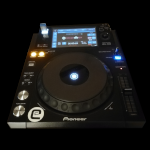

# libcdj

  <->    <->   

Binaries and native libraries for communicating with Pioneer CDJs and XDJs.

This is based on protocol analysis by [Deep-Symmetry](https://github.com/Deep-Symmetry/) who has discovered and collated most  of what is known by the opensource communit about Pioneers ProDJLink protocol.

N.B for tools written in python head over to [python-prodj-link](https://github.com/flesniak/python-prodj-link)

## Components

- `libcdj` - common lib for handling messages and extracting data that is known from within the protocol  
  e.g. taking a beat packet and extracting the bpm.
- `libvdj` - common lib to create virtual CDJs that partake in a ProLink network.  
  this handles internally discovery, keep alive, network connection and tracking the "backline", i.e. all the known CDJs and rekordbox instances on the network
- `vdj` - cli app that uses libvdj
- `vdj-debug` - tool to dump ProLink messages
- `cd-mon` - monitor UDB broadcasts on a ProLink network

