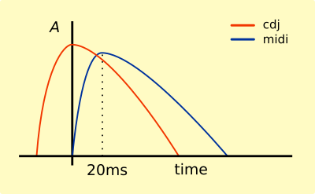
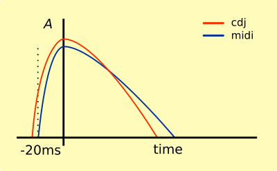
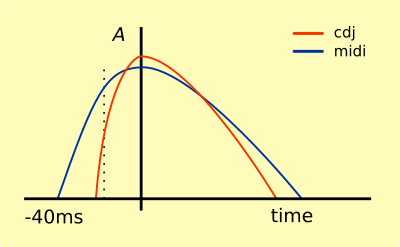
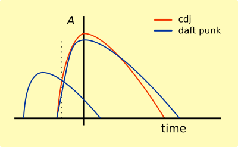

# CDJ timing issues

The XDJs I have in front of me claim to be running at 120.00 bpm when my alsa midi sequencer claims to be runing at 121.95. I suspect the XDJs are running fast.

XDJ is likely busybox Linux (according to OS licenses published by Pioneer) which implies its not running a mighty fast CPU.  It clearly has a sound card that can keep pitch to 22Khz but it seems from experimentation that the BPM and pitch control handling is not using high resolution timers.

I believe there may be a way to get CDJ/XDJs to sync time to a ntp server on the network, there is a function called `readTimeServerRequest` in rekordbox, but we have not yet discovered how to become a time master.  Anyone know how to reverse engineer an `.exe` ?  The digital millennium copyright act implies this would be legal in the US if the purpopse in interop, which in this case it definitely is.

Without NTPs it seems likely that millisecond time would drift and it experimentation indicates it does. This drift necessitates sync for very long mixes or live dubbing. `adj` lets you do this by ear, but also provides some tools for syncin CDJs to midi devices.

For syncing most music with midi this is not really a noticeable issue, auto nudge on the 4th beat is able to keep alsa in time with CDJs without a noticeable skew if the BPM is copied directly from the CDJ.  This is a shame it would be nice if 123.23 BPM on a CDJ would beat sync to a midi device at 123.23 bpm for a while without nudging.

## Beat syncing midi and audio tracks

Syncing the _start_ of the beat is complicated by the fact that midi starts a sample on the midi tick but CDJs mark beat grids at the peak of the beat's volume.  This problem is not limited to `adj` its intrinsic to mixing midi and audio.  An explanation follows...

If you start a midi sequencer at the same moment in milliseconds of an audio track with beat grid the midi track will appear to be late.

The midi track needs to be nudged by a few milliseconds to be in sync, even 20ms is noticeable and a good DJ will have better timing than this.  A human DJ naturally compensates for various latencies, A computer may have latency in the hardware and network that are very low but there is always some latency to compensate for, for example, a human DJ has to compensate for the speed of sound if their monitors are more than a few meters away.

When mixing vinyl a good DJ will pull the track back to before the start of the beat and play the track forward so the peak of the beat is in sync with a different audio source to a precision of within a few milliseconds.

This is only possible if you can hear the audio before the beat's peak in advance, you will notice DJs tend to move the track back and forth first to find the exact point.  It's quite easy and natural for a human to drop a track at the correct point with vinyl, even if the attack (the length of the sound before the peak) on the beat is long.

Its as easy for a human DJ to sync two records with a 20ms attack as with a 40ms attack or longer.
 I was fortunate enough to hear Benga playing a crazy post dub-step set with such long attacks to the sounds there were almost nothing you could call a beat. All sounds were low attack pulsations for the whole session.  He was mixing live, presumably with a lot of his own produced material.  Mixing this sort of music automatically is nigh on impossible for a computer, while fairly natural for a human DJ.

Another problem for midi mixing and auto-syncing is mixing _pre-echos_.  Daft punk's famous kick sound is produced by layering a quieter beat directly before each of the main beats, giving that unmistakable _flup_ _flup_ flup_ sounding kick.  Its hard for auto syncing tools to know what is the start of the beat or the pre-echo. Its hard for human DJs too. There are some combinations of tracks that sound better mixed on the attack of the pre-echo, its impossible for a computer to make that call, its a matter of taste. Rekordbox will often get this wrong and its require a human to touch up the beat grid.

Without access to the samples of the audio its impossible to tell the attack of the beat on either the the midi track or the CDJ time codes.  While pioneer can apply a single algorithm to all music passed through rekordbox, and we can access that beat grid info, and we can calculate and compensate for network latency and sound card latency, we cannot match it to live midi with more accuracy than a human DJ because we do not know what audio is playing as a result of each midi beat. There may be no audio, `adj` can be used to sync lighting or video effects to the mix.  
For these reasons `adj` makes no attempt to auto sync the start of the beat across CDJs and midi, we can mix CDJs with CDJs, midi with midi,  but midi with CDJs is intrinsically complicated and requires either hard coded assumptions about the attack or lots of fiddly options while a human DJ can resolve these issues without even knowing they are doing it.

# `adj` sync algorithm

Current syncing algorithm in `adj` permits low attacks down to _half a beat_ early only, you will notice the diff reported is always less that `+-500ms` at 120bpm.   
CDJs do provide a bar position so it is possible (presuming 4 beats) to keep tracks in sync that are completely  out of phase of beat and bar position.  For out of phase mixing, currently, you are better off practicing with specific hardware, getting a feel for the clocks diffs, setting BPMs by hand and mixing live. It seems the Pioneer decks make this same trade off in some cases. In the Prolink protocol the decks inform each other if they are syncing on the beat-grid information of a track or if the DJ has touched up the sync by hand.  This is transparent to the DJ up to a point, if you push it the deck will flash BEAT SYNC ON in red as a warning that your adjustments are being ignored.  As a DJ, I started with vinyl and find that pioneer decks with sync on make unexpected re-syncs when dropping tracks, so I mix with sync off, unless I wish to adjust the tempo on two track simultaneously.  If you tend to mix with auto-sync on there may be a learning curve to `adj` until I provide a way to hard code  offsets when `adj` starts.

# `adj` loops

Currently trigger features quantized jumps (how CDJs implement loops) don't work nicely, they need nudges afterwards or auto resyncing because they fire off arriving CDJ beat events. Usually a beat event is too late. In most cases we need to fire the midi event _before_ the beat arrives from a CDJ. That involves timers and predicting the arrival of future beats based on tempo, past beat packets and bar position. The data is in the protocol, the code is in the pipeline, but not available at time of writing.

The midi kit I'm using, e.g. a Roland drum machine always loops, so I have no need for jump points in the midi sequence, my drum machine loops itself and counts midi ticks as timing advice not song position. I presume most eletronic synths work the same way so quantized jumps is not high on my list of priorities.

